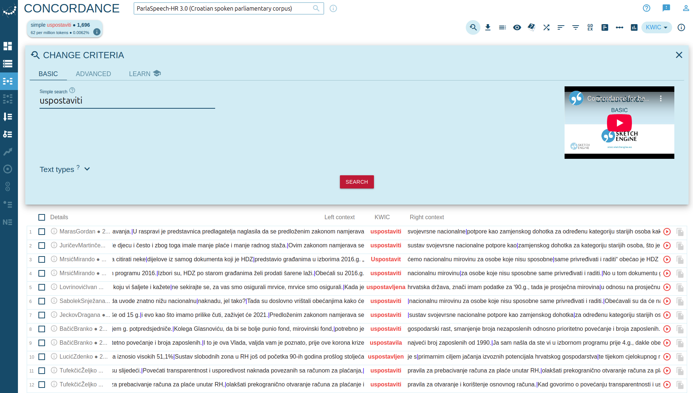
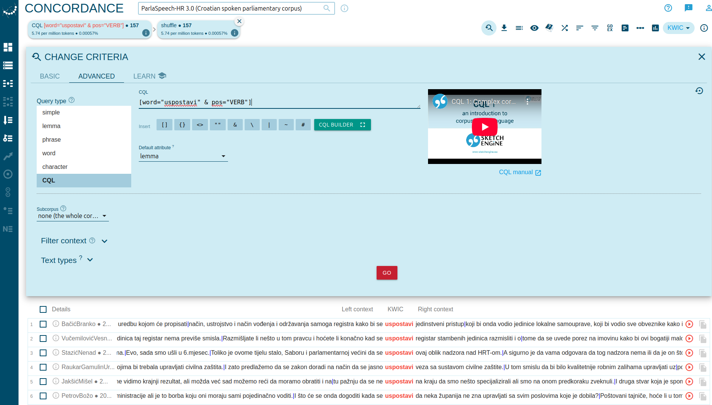

# Using the ParlaSpeech Concordancer

The **ParlaSpeech Concordancer** enables detailed linguistic and prosodic searches in the **ParlaSpeech v3 corpus**.  
This guide provides a walkthrough of its basic and advanced functionalities, designed for both linguists and interested non-specialists.

---

## 1. Simple Search (Word or Lemma)

Suppose we are interested in the verb **"uspostaviti"** ("to establish").  
We can begin with a **lemma search**, which retrieves **all inflectional forms** of that lemma.

### Query: uspostaviti
[Try the query](https://www.clarin.si/ske/#concordance?corpname=parlaspeech3_hr&tab=basic&keyword=uspostaviti&attrs=word&viewmode=kwic&attr_allpos=all&refs_up=0&shorten_refs=1&glue=1&gdexcnt=300&show_gdex_scores=0&itemsPerPage=20&structs=s%2Cg&refs=&showresults=1&showTBL=0&tbl_template=&gdexconf=&f_tab=basic&f_showrelfrq=1&f_showperc=0&f_showreldens=0&f_showreltt=0&c_customrange=0&t_attr=&t_absfrq=0&t_trimempty=1&t_threshold=5&operations=%5B%7B%22name%22%3A%22iquery%22%2C%22arg%22%3A%22uspostaviti%22%2C%22query%22%3A%7B%22queryselector%22%3A%22iqueryrow%22%2C%22iquery%22%3A%22uspostaviti%22%7D%2C%22id%22%3A399%7D%5D)

This will return occurrences of various forms, such as:

- **uspostavi**  
- **uspostavljamo**  
- **uspostavljena**, etc.

It is suggested to **play each audio segment** (red play button on the right side) to verify it is correct.

---

---

## 2. Advanced Search: Word Form

To search for a **specific word form**, we can input the word directly. For example:

### Query: uspostavi
[Try the query](https://www.clarin.si/ske/#concordance?corpname=parlaspeech3_hr&tab=advanced&queryselector=word&keyword=uspostavi&attrs=word&viewmode=kwic&attr_allpos=all&refs_up=0&shorten_refs=1&glue=1&gdexcnt=300&show_gdex_scores=0&itemsPerPage=20&structs=s%2Cg&refs=%3Dspeech.speaker_id%2C%3Dspeech.date&default_attr=lemma&cql=%5Bword%3D%22uspostavi%22%20%26%20pos%3D%22VERB%22%5D&showresults=1&showTBL=0&tbl_template=&gdexconf=&f_tab=basic&f_showrelfrq=1&f_showperc=0&f_showreldens=0&f_showreltt=0&c_customrange=0&t_attr=&t_absfrq=0&t_trimempty=1&t_threshold=5&operations=%5B%7B%22name%22%3A%22word%22%2C%22arg%22%3A%22uspostavi%22%2C%22query%22%3A%7B%22queryselector%22%3A%22wordrow%22%2C%22word%22%3A%22uspostavi%22%2C%22qmcase%22%3Afalse%7D%2C%22id%22%3A4390%7D%5D)

**Why refine the search?**

The form **uspostavi** is **ambiguous**. It may function as:

- **Verb** (e.g., _"He/She establishes"_)  
- **Noun** (e.g. _"The establishment of"_)

To avoid retrieving unrelated occurrences, further filtering is needed.

## 3. Advanced Search: CQL with Part of Speech (POS)

To disambiguate between different **parts of speech**, we use **Corpus Query Language (CQL)**.  
In this case, to extract only the **verb** usages of *uspostavi*, the query is:

### Query: [word="uspostavi" & pos="VERB"]
[Try the query](https://www.clarin.si/ske/#concordance?corpname=parlaspeech3_hr&tab=advanced&queryselector=cql&keyword=uspostaviti&attrs=word&viewmode=kwic&attr_allpos=all&refs_up=0&shorten_refs=1&glue=1&gdexcnt=300&show_gdex_scores=0&itemsPerPage=20&structs=s%2Cg&refs=%3Dspeech.speaker_id%2C%3Dspeech.date&default_attr=lemma&cql=%5Bword%3D%22uspostavi%22%20%26%20pos%3D%22VERB%22%5D&showresults=1&showTBL=0&tbl_template=&gdexconf=&f_tab=basic&f_showrelfrq=1&f_showperc=0&f_showreldens=0&f_showreltt=0&c_customrange=0&t_attr=&t_absfrq=0&t_trimempty=1&t_threshold=5&operations=%5B%7B%22name%22%3A%22cql%22%2C%22arg%22%3A%22%5Bword%3D%5C%22uspostavi%5C%22%20%26%20pos%3D%5C%22VERB%5C%22%5D%22%2C%22query%22%3A%7B%22queryselector%22%3A%22cqlrow%22%2C%22cql%22%3A%22%5Bword%3D%5C%22uspostavi%5C%22%20%26%20pos%3D%5C%22VERB%5C%22%5D%22%2C%22default_attr%22%3A%22lemma%22%7D%2C%22id%22%3A5463%7D%5D)

#### Annotation Standards:

- **word** – surface form  
- **pos** – **Universal Dependencies (UD)** part-of-speech tag

This ensures our search is **morphosyntactically precise**.

---

---

## 4. Advanced Search: Primary Stress

The ParlaSpeech corpus includes **prosodic annotations**, such as **primary stress placement**.

For example, the **verb** *uspostavi* is typically pronounced with **stress on the 2nd syllable**.

### Query: [word="uspostavi" & pos="VERB" & primary_stress="2"]
[Try the query](https://www.clarin.si/ske/#concordance?corpname=parlaspeech3_hr&tab=advanced&queryselector=cql&keyword=uspostaviti&attrs=word&viewmode=kwic&attr_allpos=all&refs_up=0&shorten_refs=1&glue=1&gdexcnt=300&show_gdex_scores=0&itemsPerPage=20&structs=s%2Cg&refs=%3Dspeech.speaker_id%2C%3Dspeech.date&default_attr=lemma&cql=%5Bword%3D%22uspostavi%22%20%26%20pos%3D%22VERB%22%20%26%20primary_stress%3D%222%22%5D&showresults=1&showTBL=0&tbl_template=&gdexconf=&f_tab=basic&f_showrelfrq=1&f_showperc=0&f_showreldens=0&f_showreltt=0&c_customrange=0&t_attr=&t_absfrq=0&t_trimempty=1&t_threshold=5&operations=%5B%7B%22name%22%3A%22cql%22%2C%22arg%22%3A%22%5Bword%3D%5C%22uspostavi%5C%22%20%26%20pos%3D%5C%22VERB%5C%22%20%26%20primary_stress%3D%5C%222%5C%22%5D%22%2C%22query%22%3A%7B%22queryselector%22%3A%22cqlrow%22%2C%22cql%22%3A%22%5Bword%3D%5C%22uspostavi%5C%22%20%26%20pos%3D%5C%22VERB%5C%22%20%26%20primary_stress%3D%5C%222%5C%22%5D%22%2C%22default_attr%22%3A%22lemma%22%7D%2C%22id%22%3A5074%7D%5D)

To explore variation or errors, we might query for **stress on the 3rd syllable**:

### Query: [word="uspostavi" & pos="VERB" & primary_stress="3"]

#### About `primary_stress`:

- Indicates the **syllable index** where stress is realized (1-based).  
- Acceptable values: `1` to *N* (number of syllables in the word).

---

---

## 5. Advanced Search: Filled Pauses (FP)

The concordancer also encodes **disfluency markers**, including **filled pauses** such as _"eee"_ or _"umm"_.

To find occurrences where the word *račun* is followed by a filled pause:
### Query: [word="račun" & fp_after="1"]
[Try the query](https://www.clarin.si/ske/#concordance?corpname=parlaspeech3_hr&tab=advanced&queryselector=cql&keyword=uspostavi&attrs=word%2Cfp_after&viewmode=kwic&attr_allpos=all&refs_up=0&shorten_refs=1&glue=1&gdexcnt=300&show_gdex_scores=0&itemsPerPage=20&structs=s%2Cg&refs=%3Dspeech.speaker_id%2C%3Dspeech.date&default_attr=lemma&cql=%5Bword%3D%22ra%C4%8Dun%22%20%26%20fp_after%3D%221%22%5D&showresults=1&showTBL=0&tbl_template=&gdexconf=&f_tab=basic&f_showrelfrq=1&f_showperc=0&f_showreldens=0&f_showreltt=0&c_customrange=0&t_attr=&t_absfrq=0&t_trimempty=1&t_threshold=5&operations=%5B%7B%22name%22%3A%22cql%22%2C%22arg%22%3A%22%5Bword%3D%5C%22ra%C4%8Dun%5C%22%20%26%20fp_after%3D%5C%221%5C%22%5D%22%2C%22query%22%3A%7B%22queryselector%22%3A%22cqlrow%22%2C%22cql%22%3A%22%5Bword%3D%5C%22ra%C4%8Dun%5C%22%20%26%20fp_after%3D%5C%221%5C%22%5D%22%2C%22default_attr%22%3A%22lemma%22%7D%2C%22id%22%3A6378%7D%5D)

To find occurrences where a filled pause precedes the word:
### Query: [word="račun" & fp_before="1"]

#### Interpretation:

- `fp_after` and `fp_before` can take values:
    - `1` – Filled pause is present  
    - `0` – No filled pause

This feature is valuable for research on **speech disfluencies**, **planning phenomena**, and **prosody-syntax interfaces**.

---

---

## Summary of Query Types

| Search Type                     | Example |
|---------------------------------|---------|
| Simple search             | `uspostaviti` |
| Advanced lemma search         | `uspostavi` |
| CQL: POS disambiguation         | `[word="uspostavi" & pos="VERB"]` |
| CQL: Stress on 2nd syllable     | `[word="uspostavi" & pos="VERB" & primary_stress="2"]` |
| CQL: Filled pause after "račun" | `[word="račun" & fp_after="1"]` |

---

## Available Attributes

| Attribute         | Description |
|------------------|-------------|
| **word**          | Surface form (orthographic) |
| **lemma**         | Lemma (canonical form) |
| **pos**           | Part of speech (UD standard) |
| **primary_stress**| Primary stress position (syllable index) |
| **fp_before**     | Filled pause before word (0 = no, 1 = yes) |
| **fp_after**      | Filled pause after word (0 = no, 1 = yes) |

---

## Additional Notes

- All searches are **case-sensitive**!
- On the top right-side, the **eye icon** can be used to display information for each individual token for easier searching.
- The system uses **Universal Dependencies (UD)** annotation conventions for morphology and syntax.
- Prosodic and disfluency annotations extend standard corpus search functionality into **speech-oriented analysis**.

---

For more information, visit the [ParlaSpeech main page](../index.html).

